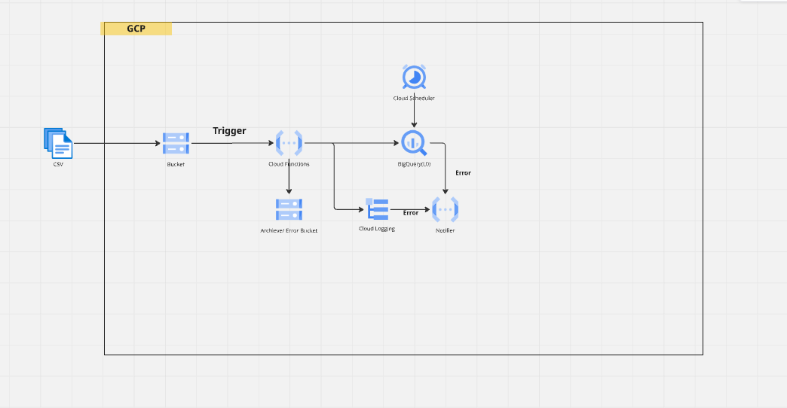

# Bank Data Pipeline

This project is designed to process banking data by ingesting files from Google Cloud Storage (GCS), validating the data, and loading it into BigQuery for further analysis. The pipeline is implemented using Python and Google Cloud services.

---

## High-Level Architecture




## Flow Description:
    1. Google Cloud Storage (GCS):

Incoming CSV files are uploaded to a GCS bucket.
The pipeline is triggered automatically when a new file is uploaded.

    2. Python Functions (Cloud Functions):

The Cloud Function processes the file by validating its format. Metadata such as FILE_NAME and FETCH_DATE is added to the data. The processed data is loaded into a temporary BigQuery table.

    3. Google BigQuery:

Data is stored in a staging table for further processing and analysis.Queries can be run on the data for insights and reporting.

## Prerequisites:

Before setting up and running the pipeline, ensure the following prerequisites are met:

    1. Google Cloud Platform:
        
 - Enable the following APIs
    
    - Cloud Logging API
    - Cloud Build API
    - Eventarc API
    - BigQuery API
    - Artifact Registry API
    - Cloud Logging API
    - IAM Service Account Credentials API
    - Identity and Access Management (IAM) API

 - ### GettingStarted
1. [Tools require to setup development environment](#tools-require-to-setup-development-environment)
2. [Clone the repository](#clone-the-repository)
3. Get inside the folder infrastructure/initiate
4. [Run terraform commands](#commands-to-run-terraform-module)
5. [sync with git](#sync-with-git)

## Tools require to setup development environment
You need to install these tools:
- [git](https://docs.github.com/en/github/getting-started-with-github/set-up-git)
- [terraform](https://www.terraform.io/downloads) -install terraform in local to run terraform project
- [GCP GCloud SDK](https://cloud.google.com/sdk/docs/install) - Setup Cloud SDK in local.
- [Visual Studio Code](https://code.visualstudio.com/) It's recommended to use visual studio code for 

### Clone the repository

```console
git clone git@github.com:adman9/data-pipeline-project
cd bank-data-pipeline/infrastructure/initiate (to configure environment)
```
### Prerequisite 
1. Create backend state bucket in gcp console if not exist already(needs to be created before running the terraform modules) which will be mentioned in backend.tf file.
2. Validate the tfvar files (prod.tfvar for prod env) and provide required variable values 
3. Need to pass values in tfvar file for variables which are not containg default values or required different configuration.

5. connect to gcp either running below command (to authenticate via user credential) or setting up in environment variable(to autheticate via service account json key)
```console
gcloud auth application-default login

```

### Commands to run terraform module

run below commands in sequence
 ```console
  terraform init (to initialize the provider)
  terraform plan -var-file prod.tfvar (to inspect the changes in environment addition/deletion/update)
  terraform apply -var-file prod.tfvar (to push the plan to actual environment)

 ```

## CICD proccess:

- Run the data-pipeline-project\.github\workflows\apply-infrastructure.yaml manually to load the components in GCP


## Monitoring

Created alerts for GCP cloud function and Big query
